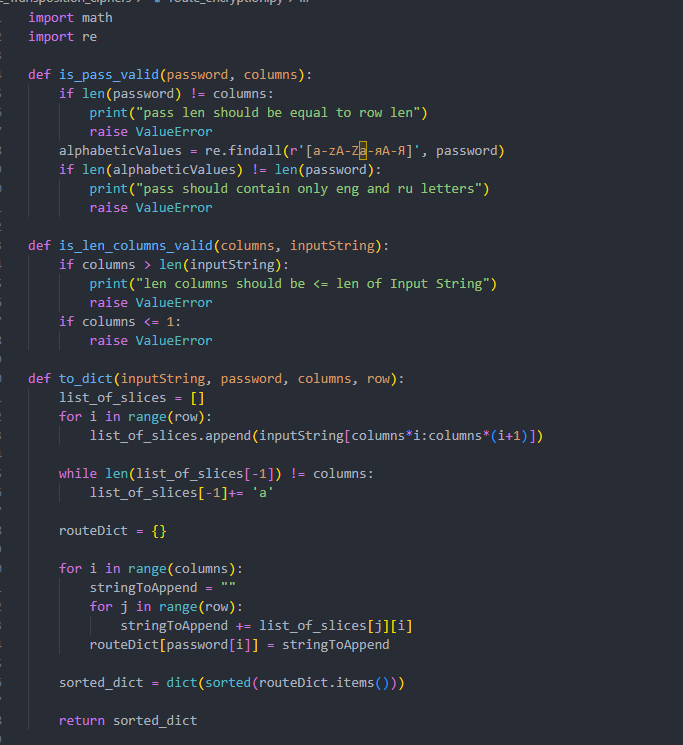
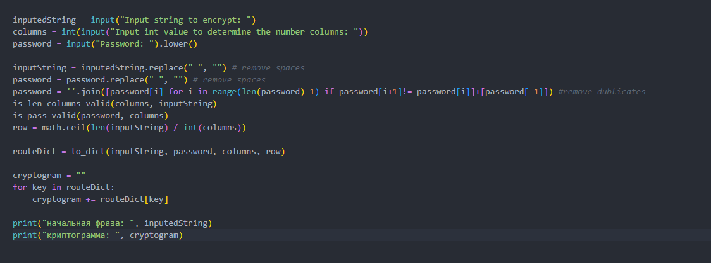
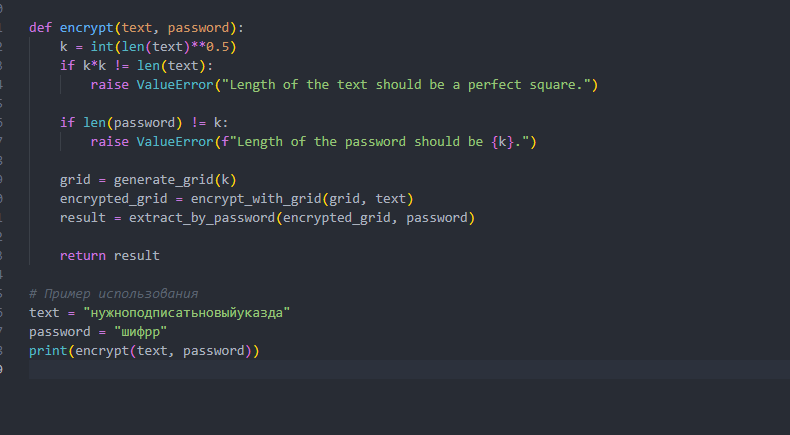
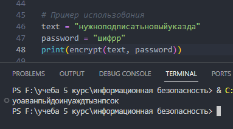
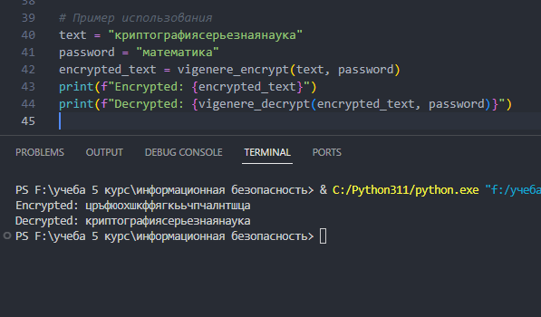

---
# Front matter
title: "Математические основы защиты информации и информационной безопасности. Отчет по лабораторной работе №2"
subtitle: "Шифры перестановки"
author: "Терентьев Егор Дмитриевич 1132236902"
group: "НФИмд-01-23"
institute: RUDN University, Moscow, Russian Federation

# Generic otions
lang: ru-RU
toc-title: "Содержание"

# Bibliography
csl: pandoc/csl/gost-r-7-0-5-2008-numeric.csl

# Pdf output format
toc: true # Table of contents
toc_depth: 2
lof: true # List of figures
lot: true # List of tables
fontsize: 12pt
linestretch: 1.5
papersize: a4
documentclass: scrreprt
### Fonts
mainfont: PT Serif
romanfont: PT Serif
sansfont: PT Sans
monofont: PT Mono
mainfontoptions: Ligatures=TeX
romanfontoptions: Ligatures=TeX
sansfontoptions: Ligatures=TeX,Scale=MatchLowercase
monofontoptions: Scale=MatchLowercase,Scale=0.9
## Biblatex
biblatex: true
biblio-style: "gost-numeric"
biblatexoptions:
  - parentracker=true
  - backend=biber
  - hyperref=auto
  - language=auto
  - autolang=other*
  - citestyle=gost-numeric
## Misc options
indent: true
header-includes:
  - \linepenalty=10 # the penalty added to the badness of each line within a paragraph (no associated penalty node) Increasing the value makes tex try to have fewer lines in the paragraph.
  - \interlinepenalty=0 # value of the penalty (node) added after each line of a paragraph.
  - \hyphenpenalty=50 # the penalty for line breaking at an automatically inserted hyphen
  - \exhyphenpenalty=50 # the penalty for line breaking at an explicit hyphen
  - \binoppenalty=700 # the penalty for breaking a line at a binary operator
  - \relpenalty=500 # the penalty for breaking a line at a relation
  - \clubpenalty=150 # extra penalty for breaking after first line of a paragraph
  - \widowpenalty=150 # extra penalty for breaking before last line of a paragraph
  - \displaywidowpenalty=50 # extra penalty for breaking before last line before a display math
  - \brokenpenalty=100 # extra penalty for page breaking after a hyphenated line
  - \predisplaypenalty=10000 # penalty for breaking before a display
  - \postdisplaypenalty=0 # penalty for breaking after a display
  - \floatingpenalty = 20000 # penalty for splitting an insertion (can only be split footnote in standard LaTeX)
  - \raggedbottom # or \flushbottom
  - \usepackage{float} # keep figures where there are in the text
  - \floatplacement{figure}{H} # keep figures where there are in the text
---

# Цель работы

Освоить на практике шифры перестановки.

# Выполнение лабораторной работы

Требуется реализовать:

1. Маршрутное шифрование.
2. Шифрование с помощью решеток.
3. Табоица Виженера

## Маршрутное шифрование

Текст разбивается на равные блоки N длиной M. Если в конце не хватает букв, то они добавляются в конец.
Блоки записываются построчно в таблицу. Затем буквы выписываются по столбцам, которые упорядываются согласно паролю:
внизу таблицы приписывается слово из n неповторяющихся букв и столбы нумеруются по алфавитному порядку букв пароля

Чтобы реализовать программу был написал след. код на python:

1. Функции проверки правильности пароля, значения k
2. Функция берущая столбцы матрицы в виде ключа буквы пароля в алфавитном порядке (был использован словарь для удобства) [@fig:1].

{#fig:1 width=100%}

Main функция в которой вводятся начальные значения, запускаются вышепоказанные функции [@fig:2].

{#fig:2 width=100%}

Вывод программы (пример как в методических материалах) [@fig:3].

{#fig:3 width=100%}

## Шифрование с помощью решеток

Строится квадрат из k чисел. Затем к нему добавляются еще 3 квадрата, которые поворачиваются на 90 градусов и получается большой квадрат 2k размерностью.
Дальше из большого квадрата вырезаются клетки и прорези записываются буквы. Когда заполнятся все прорези решето поворачивается на 90 градусов.
И так продолжается пока не заполнится вся таблица. И буквы выписываются по алфивитному порядку пароля.

Чтобы реализовать программу был написал след. код на python:

1. Функция генерирующая сетку (матрицу) (использована библиотека numpy Для удобства) и ее заполнение
2. Функция заполняющая сетку значениями букв из текста и переворачивающая матрицу
3. Функция выбираюшая столбцы в алфавитном порядке пароля
4. Функция объединяющая все вышепоказанные функции и проверки правильности введенных данных [@fig:4]

{#fig:4 width=100%}

Main функция запуска программы [@fig:5]

{#fig:5 width=100%}

Пример работы программы [@fig:6]

{#fig:6 width=100%}

## Таблица Виженера

В таблице записаны буквы русского алфавита. При переходе от одной  строке к другой происходит циклический сдвиг на одну позицию.
Пароль записывается с повторениями над буквами сообщения.
В горизонтальном алфавите ищем букву нашего текста, а в вертикальном букву пароля и на их пересечении будет нужная нам буква.

Чтобы реализовать программу был написал след. код на python:

1. Функция шифрования (построение таблицы Вижинера)
2. Функция дешифровки [@fig:7]

{#fig:7 width=100%}

Main функция запуска программы [@fig:8]

{#fig:8 width=100%}

Пример работы программы (как в методических материалах) [@fig:9]

{#fig:9 width=100%}

# Выводы

В результате выполнения работы я освоил на практике применение шифров перестановки.

# Список литературы

1. Методические материалы курса
