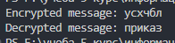

---
# Front matter
title: "Математические основы защиты информации и информационной безопасности. Отчет по лабораторной работе №3"
subtitle: "Шифрование гаммированием"
author: "Терентьев Егор Дмитриевич 1132236902"
group: "НФИмд-01-23"
institute: RUDN University, Moscow, Russian Federation

# Generic otions
lang: ru-RU
toc-title: "Содержание"

# Bibliography
csl: pandoc/csl/gost-r-7-0-5-2008-numeric.csl

# Pdf output format
toc: true # Table of contents
toc_depth: 2
lof: true # List of figures
lot: true # List of tables
fontsize: 12pt
linestretch: 1.5
papersize: a4
documentclass: scrreprt
### Fonts
mainfont: PT Serif
romanfont: PT Serif
sansfont: PT Sans
monofont: PT Mono
mainfontoptions: Ligatures=TeX
romanfontoptions: Ligatures=TeX
sansfontoptions: Ligatures=TeX,Scale=MatchLowercase
monofontoptions: Scale=MatchLowercase,Scale=0.9
## Biblatex
biblatex: true
biblio-style: "gost-numeric"
biblatexoptions:
  - parentracker=true
  - backend=biber
  - hyperref=auto
  - language=auto
  - autolang=other*
  - citestyle=gost-numeric
## Misc options
indent: true
header-includes:
  - \linepenalty=10 # the penalty added to the badness of each line within a paragraph (no associated penalty node) Increasing the value makes tex try to have fewer lines in the paragraph.
  - \interlinepenalty=0 # value of the penalty (node) added after each line of a paragraph.
  - \hyphenpenalty=50 # the penalty for line breaking at an automatically inserted hyphen
  - \exhyphenpenalty=50 # the penalty for line breaking at an explicit hyphen
  - \binoppenalty=700 # the penalty for breaking a line at a binary operator
  - \relpenalty=500 # the penalty for breaking a line at a relation
  - \clubpenalty=150 # extra penalty for breaking after first line of a paragraph
  - \widowpenalty=150 # extra penalty for breaking before last line of a paragraph
  - \displaywidowpenalty=50 # extra penalty for breaking before last line before a display math
  - \brokenpenalty=100 # extra penalty for page breaking after a hyphenated line
  - \predisplaypenalty=10000 # penalty for breaking before a display
  - \postdisplaypenalty=0 # penalty for breaking after a display
  - \floatingpenalty = 20000 # penalty for splitting an insertion (can only be split footnote in standard LaTeX)
  - \raggedbottom # or \flushbottom
  - \usepackage{float} # keep figures where there are in the text
  - \floatplacement{figure}{H} # keep figures where there are in the text
---

# Цель работы

Освоить на практике шифрование гаммированием.

# Выполнение лабораторной работы

Требуется реализовать:

1. Шифрование гаммированием

## Шифрование гаммированием

Шифрование гаммированием - это метод симметричного шифрования, при котором каждый символ или байт исходного сообщения комбинируется с соответствующим символом или байтом ключа (гаммы) с помощью определенной операции, чаще всего XOR.

Основные шаги:

1. Выбор гаммы (ключа): Гамма — это последовательность, которая комбинируется с исходным сообщением. Гамма может быть случайной или генерироваться на основе ключа.

2. Применение гаммы к сообщению: Гамма "наложится" на исходное сообщение. Если гамма короче сообщения, она циклически повторяется.

3. Комбинирование гаммы и сообщения: Наиболее популярная операция для этого — XOR. Если мы говорим о символьном шифровании, то комбинирование может включать в себя сложение (или вычитание для дешифрования) позиций символов в алфавите.

4. Дешифрование: Чтобы дешифровать сообщение, мы применяем ту же операцию комбинирования к зашифрованному сообщению и той же гамме. Если использовалась операция XOR, то повторное применение XOR с той же гаммой вернёт исходное сообщение.

Чтобы реализовать программу был написал след. код на python:

1. Функции получения пар значений ключа и сообщения
2. Функция шифрования, которая берет пары значений и складывает их место в алфавите получая нужную букву шифрования [@fig:1].

{#fig:1 width=100%}

Выходные значения программы (пример из методички) [@fig:2].

{#fig:2 width=100%}

# Выводы

В результате выполнения работы я освоил на практике применение шифрование гаммированием.

# Список литературы

1. Методические материалы курса
