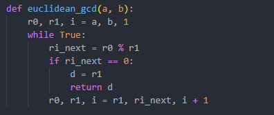
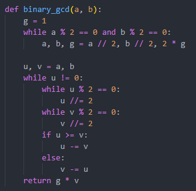
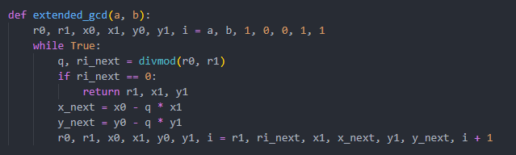
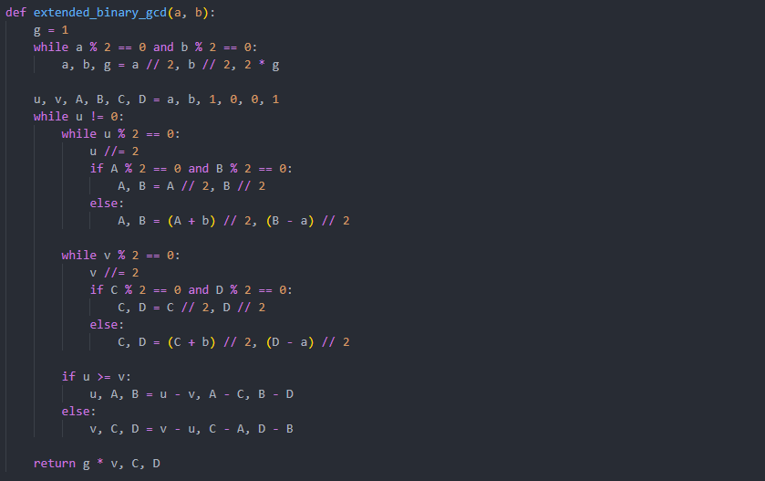
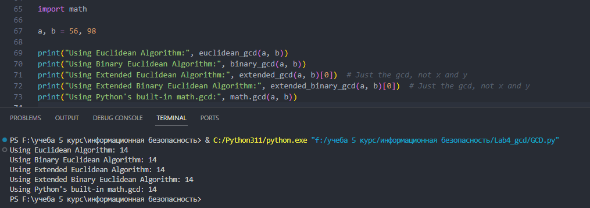

---
# Front matter
title: "Математические основы защиты информации и информационной безопасности. Отчет по лабораторной работе №4"
subtitle: "Алгоритмы нахождения НОД"
author: "Терентьев Егор Дмитриевич 1132236902"
group: "НФИмд-01-23"
institute: RUDN University, Moscow, Russian Federation

# Generic otions
lang: ru-RU
toc-title: "Содержание"

# Bibliography
csl: pandoc/csl/gost-r-7-0-5-2008-numeric.csl

# Pdf output format
toc: true # Table of contents
toc_depth: 2
lof: true # List of figures
lot: true # List of tables
fontsize: 12pt
linestretch: 1.5
papersize: a4
documentclass: scrreprt
### Fonts
mainfont: PT Serif
romanfont: PT Serif
sansfont: PT Sans
monofont: PT Mono
mainfontoptions: Ligatures=TeX
romanfontoptions: Ligatures=TeX
sansfontoptions: Ligatures=TeX,Scale=MatchLowercase
monofontoptions: Scale=MatchLowercase,Scale=0.9
## Biblatex
biblatex: true
biblio-style: "gost-numeric"
biblatexoptions:
  - parentracker=true
  - backend=biber
  - hyperref=auto
  - language=auto
  - autolang=other*
  - citestyle=gost-numeric
## Misc options
indent: true
header-includes:
  - \linepenalty=10 # the penalty added to the badness of each line within a paragraph (no associated penalty node) Increasing the value makes tex try to have fewer lines in the paragraph.
  - \interlinepenalty=0 # value of the penalty (node) added after each line of a paragraph.
  - \hyphenpenalty=50 # the penalty for line breaking at an automatically inserted hyphen
  - \exhyphenpenalty=50 # the penalty for line breaking at an explicit hyphen
  - \binoppenalty=700 # the penalty for breaking a line at a binary operator
  - \relpenalty=500 # the penalty for breaking a line at a relation
  - \clubpenalty=150 # extra penalty for breaking after first line of a paragraph
  - \widowpenalty=150 # extra penalty for breaking before last line of a paragraph
  - \displaywidowpenalty=50 # extra penalty for breaking before last line before a display math
  - \brokenpenalty=100 # extra penalty for page breaking after a hyphenated line
  - \predisplaypenalty=10000 # penalty for breaking before a display
  - \postdisplaypenalty=0 # penalty for breaking after a display
  - \floatingpenalty = 20000 # penalty for splitting an insertion (can only be split footnote in standard LaTeX)
  - \raggedbottom # or \flushbottom
  - \usepackage{float} # keep figures where there are in the text
  - \floatplacement{figure}{H} # keep figures where there are in the text
---

# Цель работы

Освоить на практике алгоритмы вычисления НОД.

# Выполнение лабораторной работы

Требуется реализовать:

1. Алгоритм Евклида
2. Бинарный алгоритм Евклида
3. Расширенный алгоритм Евклида
4. Расширенный бинарный алгоритм Евклида

## Алгоритм Евклида

Основные шаги:

1. Берёт два числа a и b, где a > b

2. Повторяет деление a на b, заменяя a значением b и b остатком от деления, пока b не станет равным 0.

3. Последнее ненулевое значение a будет НОД.

Реализация на Python предствлена на рисунке 1 [@fig:1].

{#fig:1 width=100%}

## Бинарный алгоритм Евклида

Основные шаги:

1. Если оба числа четные, делит оба числа на 2 и удваивает итоговый НОД

2. Если только одно из чисел четное, делит только его на 2.

3. Из большего числа вычитает меньшее.

4. Повторяет процесс, пока числа не станут равными. Это число становится НОД, умноженным на полученный ранее множитель.

Реализация на Python предствлена на рисунке 2 [@fig:2].

{#fig:2 width=100%}

## Расширенный алгоритм Евклида

Основные шаги:

1. Кроме нахождения НОД, алгоритм находит такие числа x и y, что ax+by=НОД(a,b).

2. Начинается с базовых коэф.: x0 = 1, y0 = 0 (для а) и x1 = 0, y1 = 1 (для b).

3. При каждом шаге обновляются значения коэффициентов, используя остаток и частное от деления.

Реализация на Python предствлена на рисунке 3 [@fig:3].

{#fig:3 width=100%}

## Расширенный бинарный алгоритм Евклида

Основные шаги:

1. Как и обычный бинарный алгоритм, но также отслеживает коэффициенты x и y.

2. Когда числа делятся на 2, коэффициенты корректируются соответствующим образом.

3. Когда из одного числа вычитается другое, соответствующие коэффициенты также вычитаются.

Реализация на Python предствлена на рисунке 4 [@fig:4].

{#fig:4 width=100%}

## Результат работы программы

Выходные значения программы [@fig:5].

{#fig:5 width=100%}

# Выводы

В результате выполнения работы я освоил на практике применение алгоритмов нахождения НОД.

# Список литературы

1. Методические материалы курса
