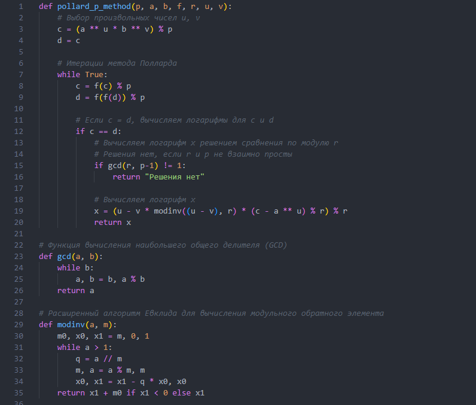
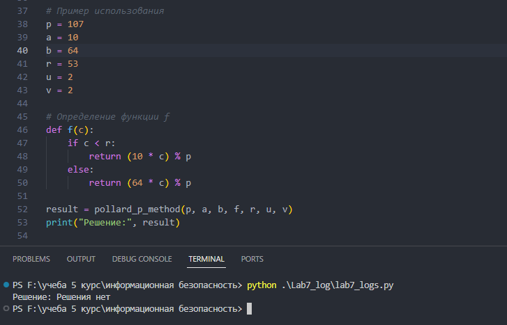

---
# Front matter
title: "Математические основы защиты информации и информационной безопасности. Отчет по лабораторной работе №7"
subtitle: "Шифрование гаммированием"
author: "Терентьев Егор Дмитриевич 1132236902"
group: "НФИмд-01-23"
institute: RUDN University, Moscow, Russian Federation

# Generic otions
lang: ru-RU
toc-title: "Содержание"

# Bibliography
csl: pandoc/csl/gost-r-7-0-5-2008-numeric.csl

# Pdf output format
toc: true # Table of contents
toc_depth: 2
lof: true # List of figures
lot: true # List of tables
fontsize: 12pt
linestretch: 1.5
papersize: a4
documentclass: scrreprt
### Fonts
mainfont: PT Serif
romanfont: PT Serif
sansfont: PT Sans
monofont: PT Mono
mainfontoptions: Ligatures=TeX
romanfontoptions: Ligatures=TeX
sansfontoptions: Ligatures=TeX,Scale=MatchLowercase
monofontoptions: Scale=MatchLowercase,Scale=0.9
## Biblatex
biblatex: true
biblio-style: "gost-numeric"
biblatexoptions:
  - parentracker=true
  - backend=biber
  - hyperref=auto
  - language=auto
  - autolang=other*
  - citestyle=gost-numeric
## Misc options
indent: true
header-includes:
  - \linepenalty=10 # the penalty added to the badness of each line within a paragraph (no associated penalty node) Increasing the value makes tex try to have fewer lines in the paragraph.
  - \interlinepenalty=0 # value of the penalty (node) added after each line of a paragraph.
  - \hyphenpenalty=50 # the penalty for line breaking at an automatically inserted hyphen
  - \exhyphenpenalty=50 # the penalty for line breaking at an explicit hyphen
  - \binoppenalty=700 # the penalty for breaking a line at a binary operator
  - \relpenalty=500 # the penalty for breaking a line at a relation
  - \clubpenalty=150 # extra penalty for breaking after first line of a paragraph
  - \widowpenalty=150 # extra penalty for breaking before last line of a paragraph
  - \displaywidowpenalty=50 # extra penalty for breaking before last line before a display math
  - \brokenpenalty=100 # extra penalty for page breaking after a hyphenated line
  - \predisplaypenalty=10000 # penalty for breaking before a display
  - \postdisplaypenalty=0 # penalty for breaking after a display
  - \floatingpenalty = 20000 # penalty for splitting an insertion (can only be split footnote in standard LaTeX)
  - \raggedbottom # or \flushbottom
  - \usepackage{float} # keep figures where there are in the text
  - \floatplacement{figure}{H} # keep figures where there are in the text
---

# Цель работы

Освоить на практике дискретное логарифмирование в конечном поле.

# Выполнение лабораторной работы

Требуется реализовать:

1. Алгоритм, реализующий p-метод Полларда для задач дискретного логарифмирования

## p-метод Полларда

Основные шаги:

Вход: Простое число p, числа a порядка r по модулю p, целое число b, 1< b < p отображение f, обладающее сжимающими свойствами и сохраняющее вычислимость логарифма
Выход: Показатель x, Для которого a^x Тождественно = b (mod p), если такой показатель существует
1. Выбрать произвольные числа u, v и положить c <- a^u * b^v (mod p), d <- c
2. Выполнять c <- f(c)(mod p), d <- f(f(d))(mod p), вычисляя при этом логарифмы для c и d как линейные функции от x по модулю r, до получения равенства c тождественно = d(mod p)
3. Приравняв логарифмы для c и d, вычислить логарифм x решением сравнения по модулю r. Результат: x или "Решения нет"

Чтобы реализовать программу был написал след. код на python:

1. Функция, реализующая p-метод Полларда
2. Функция нахождения НОД 
3. Расширенный алгоритм Евклида для вычисления модульного обратного элемента [@fig:1].

{#fig:1 width=100%}

Выходные значения программы  [@fig:2].

{#fig:2 width=100%}

# Выводы

В результате выполнения работы я освоил на практике дискретное логарифмирование в конечном поле.

# Список литературы

1. Методические материалы курса
