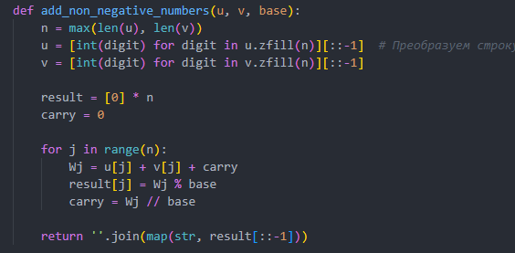
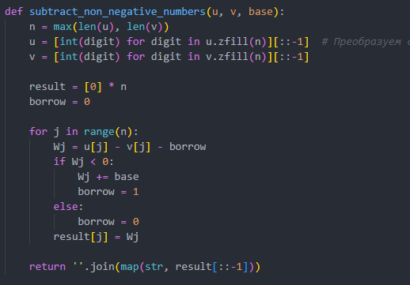
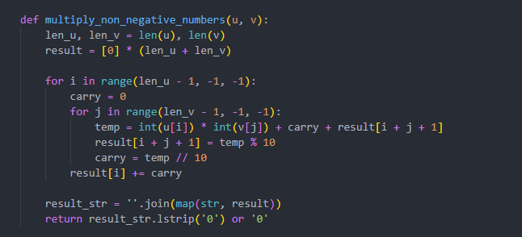
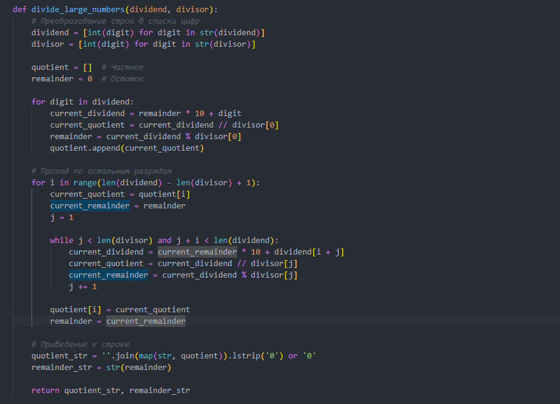
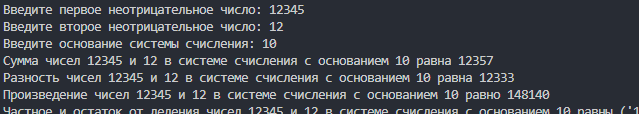

---
# Front matter
title: "Лабораторная работа 8"
author: "Терентьев Егор Дмитриевич, НФИмд-01-23"

# Generic otions
lang: ru-RU
toc-title: "Содержание"

# Bibliography
bibliography: bib/cite.bib
csl: pandoc/csl/gost-r-7-0-5-2008-numeric.csl

### Fonts
mainfont: PT Serif
romanfont: PT Serif
sansfont: PT Sans
monofont: PT Mono
mainfontoptions: Ligatures=TeX
romanfontoptions: Ligatures=TeX
sansfontoptions: Ligatures=TeX,Scale=MatchLowercase
monofontoptions: Scale=MatchLowercase,Scale=0.9
## Biblatex
biblatex: true
biblio-style: "gost-numeric"
biblatexoptions:
  - parentracker=true
  - backend=biber
  - hyperref=auto
  - language=auto
  - autolang=other*
  - citestyle=gost-numeric
## Misc options
indent: true
header-includes:
  - \linepenalty=10 # the penalty added to the badness of each line within a paragraph (no associated penalty node) Increasing the value makes tex try to have fewer lines in the paragraph.
  - \interlinepenalty=0 # value of the penalty (node) added after each line of a paragraph.
  - \hyphenpenalty=50 # the penalty for line breaking at an automatically inserted hyphen
  - \exhyphenpenalty=50 # the penalty for line breaking at an explicit hyphen
  - \binoppenalty=700 # the penalty for breaking a line at a binary operator
  - \relpenalty=500 # the penalty for breaking a line at a relation
  - \clubpenalty=150 # extra penalty for breaking after first line of a paragraph
  - \widowpenalty=150 # extra penalty for breaking before last line of a paragraph
  - \displaywidowpenalty=50 # extra penalty for breaking before last line before a display math
  - \brokenpenalty=100 # extra penalty for page breaking after a hyphenated line
  - \predisplaypenalty=10000 # penalty for breaking before a display
  - \postdisplaypenalty=0 # penalty for breaking after a display
  - \floatingpenalty = 20000 # penalty for splitting an insertion (can only be split footnote in standard LaTeX)
  - \raggedbottom # or \flushbottom
  - \usepackage{float} # keep figures where there are in the text
  - \floatplacement{figure}{H} # keep figures where there are in the text
---

##### РОССИЙСКИЙ УНИВЕРСИТЕТ ДРУЖБЫ НАРОДОВ

##### Факультет физико-математических и естественных наук

##### ПРЕЗЕНТАЦИЯ ПО ЛАБОРАТОРНОЙ РАБОТЕ №7

дисциплина: Математические основы защиты информации и информационной безопасности

Преподователь: Кулябов Дмитрий Сергеевич

Cтудент: Терентьев Егор Дмитриевич

Группа: НФИмд-01-23

МОСКВА

2023 г.

# **Прагматика выполнения лабораторной работы**

Требуется реализовать:

1. Алгоритм сложения неотрицательных целых чисел
1. Алгоритм вычитания неотрицательных целых чисел
1. Алгоритм умножения неотрицательных целых чисел столбиком
1. Алгоритм деления многоразрядных целых чисел

# **Цель работы**

Освоить на практике целочисленную арифметику многократной точности

# **Выполнение лабораторной работы**

## 1. Алгоритм сложения неотрицательных целых чисел основан на стандартном методе сложения в столбик. Две числа выравниваются по разрядам, затем происходит поэлементное сложение с учетом переносов. Результат представляется в виде строки.

## 2. Алгоритм вычитания неотрицательных целых чисел основан на стандартном методе вычитания в столбик. Два числа выравниваются по разрядам, и происходит поэлементное вычитание с учетом заемов. Результат представляется в виде строки.

## 3. Алгоритм умножения неотрицательных чисел столбиком базируется на стандартном методе умножения в столбик. Два числа представлены в виде списков цифр, и происходит поэлементное умножение с учетом позиции разрядов. Промежуточные результаты суммируются, и конечный результат представляется в виде строки.

## 4. Алгоритм деления многоразрядных целых чисел основан на делении в столбик. Делимое и делитель представлены в виде списков цифр. Алгоритм пошагово вычисляет цифры частного и остаток, используя текущие разряды. Результаты объединяются в строки для представления частного и остатка.

## 5. Вывод программы: 

# Выводы

В результате выполнения работы я освоил на практике дискретное логарифмирование в конечном поле.
